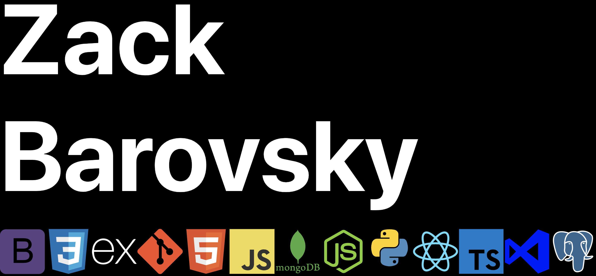

 

## Hello Everyone!
My name is Zack Barovsky(He/Him) and I am a software engineer, and aspiring game dev based in the Seattle area. After years of social work, I decided to follow my passion for coding. Now, I'm a full stack engineer who enjoys collaborating with others to help bring action to their goals. When I'm not coding I'm usually found playing music or videogames. Want to know more, [check out my portfolio](https://zackbarovsky.dev/)!

 

## Skills

 

## GitHub Stats

 

<!--
**zbarovsky/zbarovsky** is a ✨ _special_ ✨ repository because its `README.md` (this file) appears on your GitHub profile.

TODO: For readjusting github repo cards

Here are some ideas to get you started:

- 🔭 I’m currently working on ...
- 🌱 I’m currently learning ...
- 👯 I’m looking to collaborate on ...
- 🤔 I’m looking for help with ...
- 💬 Ask me about ...
- 📫 How to reach me: ...
- 😄 Pronouns: ...
- ⚡ Fun fact: ...
-->
